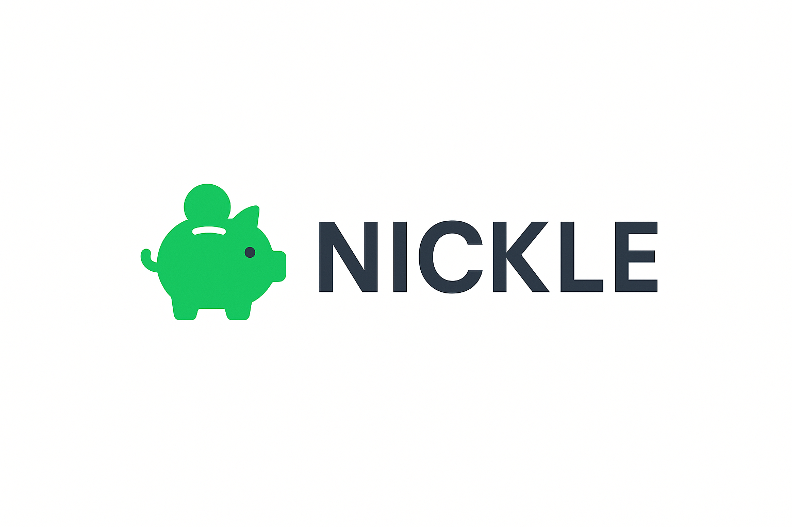

# Nickle Brand Assets Package

**Version 1.0** | November 2025

Welcome to the Nickle brand assets package! This folder contains everything you need to maintain consistent branding across all Nickle touchpoints.

---

## 📁 Package Contents

### `/logos`
Logo variations in multiple formats:
- `nickle-logo-horizontal.png` - Primary horizontal logo (use this most often)
- `nickle-logo-vertical.png` - Vertical stacked logo (for square spaces)
- `nickle-icon-only.png` - Icon/symbol only (for app icons, favicons)
- `nickle-logo-dark-bg.png` - Logo for dark backgrounds

### `/colors`
- `NICKLE-COLOR-PALETTE.md` - Complete color specifications with HEX, RGB, CMYK values

### `/templates`
- `social-media-template.png` - Ready-to-use social media post template

### Root Files
- `NICKLE-BRAND-GUIDELINES.md` - **START HERE** - Complete brand guidelines
- `README.md` - This file

---

## 🚀 Quick Start

1. **Read the Brand Guidelines** - Open `NICKLE-BRAND-GUIDELINES.md` for complete usage instructions
2. **Choose Your Logo** - Use `nickle-logo-horizontal.png` for most applications
3. **Use Brand Colors** - Reference `colors/NICKLE-COLOR-PALETTE.md` for exact color codes
4. **Follow the Rules** - Maintain clear space, don't modify logos, use approved colors only

---

## 🎨 Brand Essentials

**Tagline:** *Smart Budgets Meet Big Ambitions*

**Primary Color:** Nickle Green (#22C55E)

**Typography:** Helvetica / Arial

**Logo Minimum Size:**
- Horizontal: 120px wide (digital) | 30mm (print)
- Vertical: 80px wide (digital) | 20mm (print)
- Icon: 32px (digital) | 10mm (print)

---

## 📋 Common Use Cases

### Website Header
```html

```

### Email Signature
```
[Logo: nickle-logo-horizontal.png - 120px wide]
Smart Budgets Meet Big Ambitions
www.nickle.co.za
```

### Social Media Profile
```
Profile Picture: nickle-icon-only.png (400x400px)
Bio: Nickle | Smart Budgets Meet Big Ambitions
```

### PDF Documents
```
Header: Logo + tagline in light gray box
Footer: "Smart Budgets Meet Big Ambitions | www.nickle.co.za"
```

---

## ✅ Brand Checklist

Before publishing any Nickle-branded material, ensure:

- [ ] Logo is from this official package (not recreated or modified)
- [ ] Logo has sufficient clear space around it
- [ ] Colors match the official palette exactly
- [ ] Tagline is included where appropriate
- [ ] Typography follows brand guidelines
- [ ] Design maintains professional, trustworthy appearance
- [ ] Accessibility standards are met (contrast ratios)

---

## 🚫 Common Mistakes to Avoid

- ❌ Don't rotate, skew, or distort the logo
- ❌ Don't change logo colors
- ❌ Don't add effects (shadows, gradients) to the logo
- ❌ Don't use colors outside the approved palette
- ❌ Don't place logo on busy backgrounds
- ❌ Don't use emojis in formal documents (PDFs, contracts)
- ❌ Don't recreate the logo from scratch

---

## 📞 Support

Need help or have questions about brand assets?

- **Website:** www.nickle.co.za
- **Email:** hello@nickle.co.za

For additional sizes, formats, or custom requests, please contact the Nickle team.

---

## 📜 License

These brand assets are proprietary to Nickle and are provided for authorized use only. Do not distribute, modify, or use outside of official Nickle projects without permission.

**© 2025 Nickle. All rights reserved.**

---

*Smart Budgets Meet Big Ambitions*
